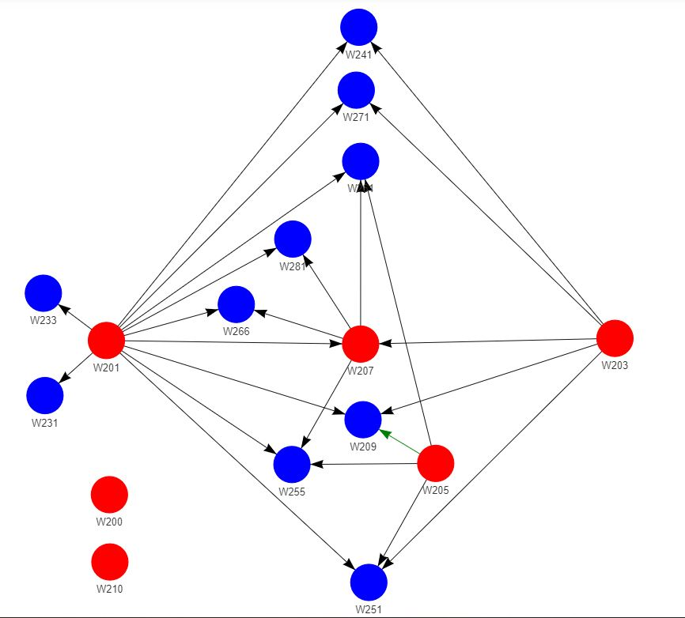

# Course Prerequisite Chart
This repo is focused on tools for generating course prerequisite charts to help navigate and plan out courses. The generated charts are based on interactive graph data structure visualizations of courses and their pre/co-requisites.

## Contents
- `graph_tools.py` - a library of graph datastructure tools to enable a quick visualization of course prerequisites using a graph data structure.
- `MIDSPrereqChart-PyVis.ipynb` - a sample notebook for generating a course prerequisite chart for the UC Berkeley MIDS program.
- `pyvis_visuals` - generated visuals in HTML format.

## Sample Visual
The following is a sample prerequisite chart generated for the UC Berkeley MIDS program (screenshot of generated chart shown):

